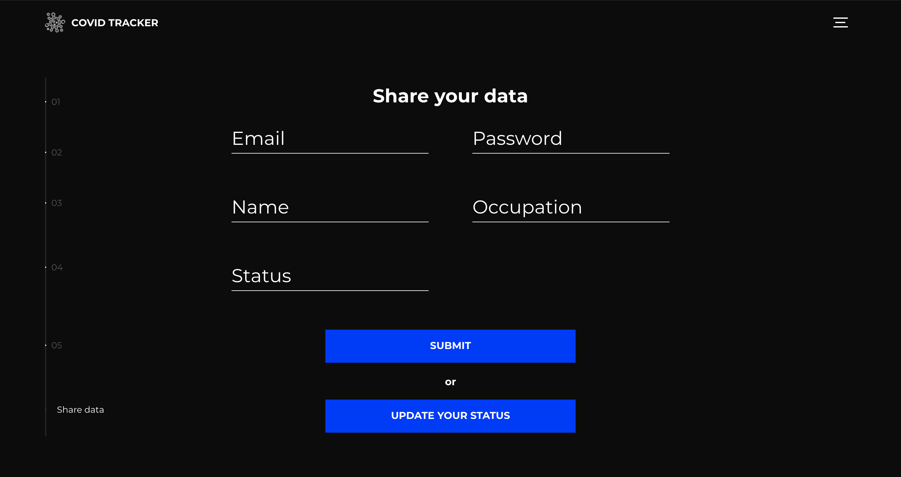
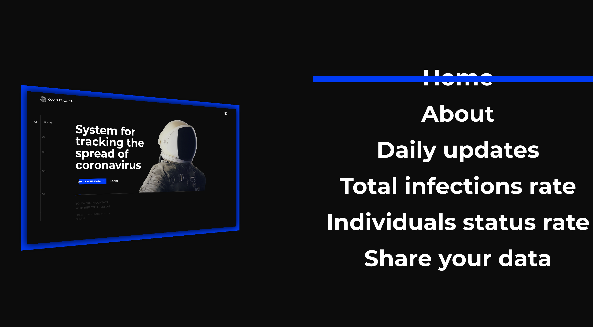

# COVID tracker web app
This application is inspired by the Coronavirus tracking system proposed by Apple and Google. The created web application is based on the idea of the contact tracing app aforementioned that could help people to be more conscious about their risk exposure. 

### Technology stack
* Python 3.8 
* Django 3.0 framework 
* Amazon Elastic Beanstalk 
* Amazon S3 
* Amazon CloudFront
* Amazon Elastic Load Balancing 
* Amazon Auto Scaling 
* AWS Identity and Access Management (IAM) 
* ElasticSearch Kibana 
* Apify service 
* HTML5, CSS3, JavaScript 

### AWS architecture

### Main features
* User sign up/sign in
* Covid-19 live statistics
* Sharing user personal data
* Updating user covid status
* Infection status notification
* Kibana integrated dashboard with simulation data
* Covid simulation start up

### Screen mockups

